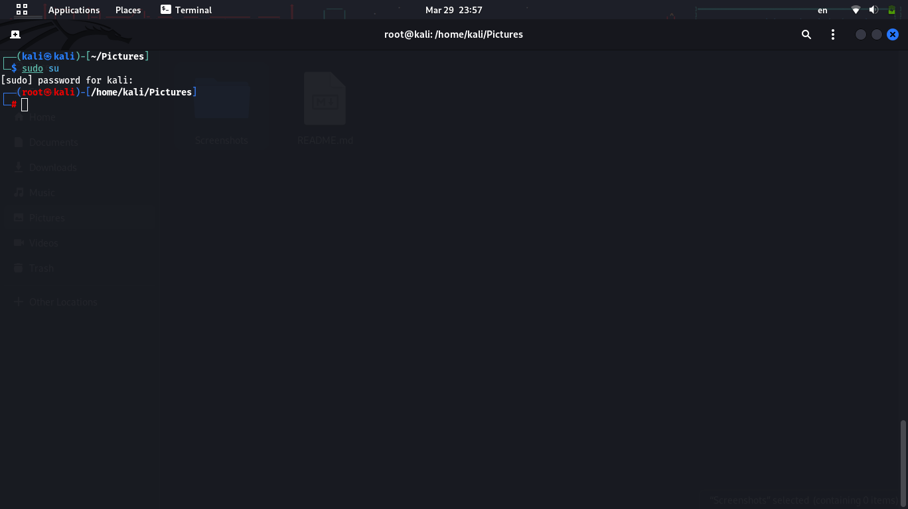
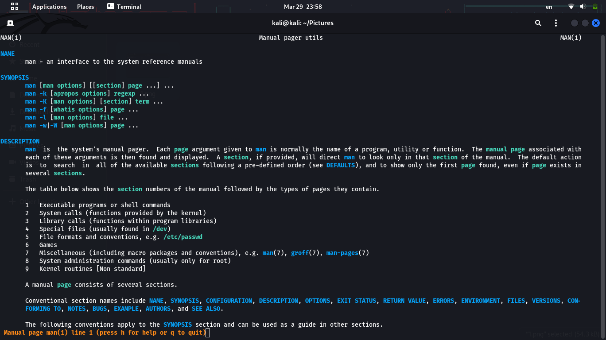
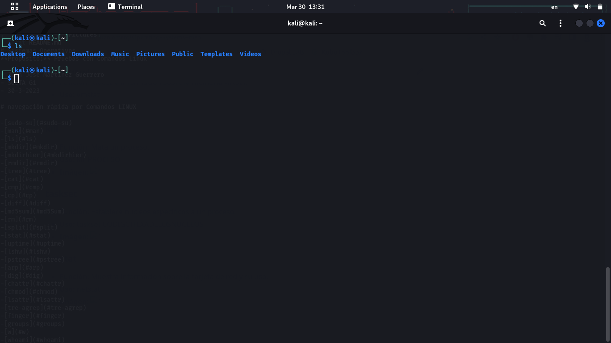
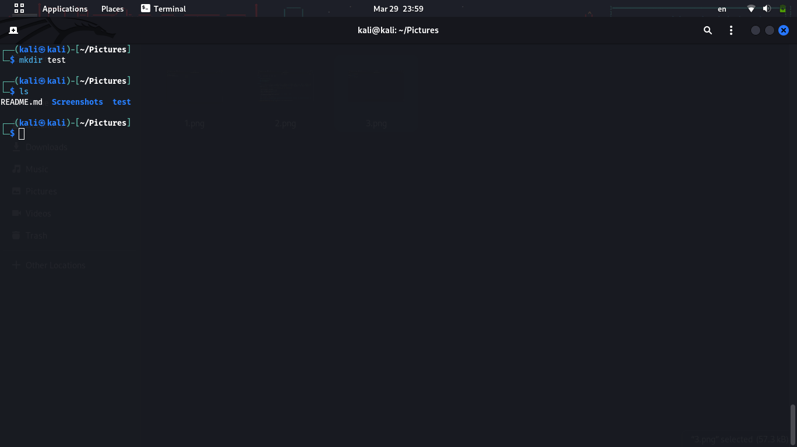
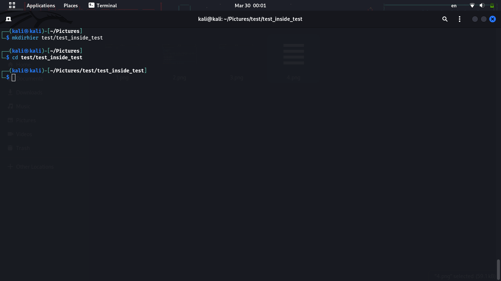

# Sistemas Operativos
**Proposito:** Pruebas con comandos Linux

- Juan José Martínez Guerrero
- SOUTA G1
- 30-3-2023

# navegación rápida por Comandos LINUX

[a](###sudo su)
[a](###man)
[a](###ls)
[a](###mkdir)
[a](###mkdirhier)
[a](###rmdir)
[a](###tree)
[a](###cat)
[a](###cm)
[a](###cp)
[a](###diff)
[a](###md5Sum)
[a](###rm)
[a](###split)
[a](###stat)
[a](###uptime)
[a](###lshw)
[a](###pstree)
[a](###ay)
[a](###arp)
[a](###dig)
[a](###chattr)
[a](###chmod)
[a](###lsattr)
[a](###tre-agrep)
[a](###finger)
[a](###groups)
[a](###w)
[a](###whoami)
[a](###add user)
[a](###chsh)
[a](###group add)
[a](###group mod)
[a](###passwd)
[a](###usermod)
[a](###rtcwake)
[a](###date)
[a](###df)
[a](###du)
[a](###uname)
[a](###vmstat)
[a](###kill)
[a](###taskset)
[a](###netstat)

### sudo su 
- **Función:** Cambia a modo Superusuario
- **Uso:**  sudo su 
- **Imágen:** 
### man  
Abre el manual de uso de un programa o comando determinado.  
man PROGRAMA/COMANDO  
 
### ls  Lista información sobre el o los archivos del directorio actual.  ls   
 mkdir  Crea un directorio con el nombre dado en el directorio actual.  mkdir DIRECTORIO   
 mkdirhier  Crea la jerarquía de directorios especificada.  mkdirhier DIRECTORIORAIZ/DIRECTORIOANIDADO   
 rmdir  elimina el directorio vacío  rmdir DIRECTORIO(vacio)   
 tree  Muestra la jerarquía del directorio actual.  tree   
 cat  Muestra en pantalla los contenidos linea a linea de un archivo.  cat ARCHIVO   
 cmp  Compara byte a byte dos archivos.  cmp ARCHIVOA ARCHIVO B   
 cp  Copia un archivo o un directorio de un punto A a un punto B.  cp ARCHIVO/DIRECTORIO DIRECTORIOALQUECOPIAR   
 diff  Compara archivos línea a línea.  diff ARCHIVOA ARCHIVOB   
 md5sum  Permite revisar checksums para prevenir alteraciones indeseadas a archivos.  md5sum ARCHIVO   
 rm  elimina el archivo o el directorio especificado.  rm ARCHIVO/DIRECTORIO   
 split  Divide un archivo en segmentos más pequeños del tamaño determinado.  split ARCHIVO   
 stat  Brinda estado de archivo o sistema.  stat ARCHIVO/NADA   
 uptime  Muestra el tiempo activo del computador durante la sesión actual.  uptime   
 lshw  Lista todo el hardware del dispositivo  lshw   
 pstree  Muestra procesos activos como árbol.  pstree   
 arp  Manipula el caché del protocolo IPv4  arp NADA/IP   
 dig  permite pedir solucionar un DNS a un servidor de DNS.  dig IP   
 chattr  Permite cambiar los atributos de un archivo  chattr +ATRIBUTO -ATRIBUTO ARCHIVO   
 chmod  Permite cambiar los permisos de acceson a un archivo  chmod COMBINACIONDEUSUARIOS ARCHIVO   
 lsattr  Lista los atributos de un archivo  lsattr ARCHIVO   
 tre-agrep  Permite buscar texto en un archivo  tre-agrep -CANTIDADDEERRORESACEPTADOS ARCHIVO   
 finger  Muestra la informacion del usuario actual y sus detalles  finger   
 groups  Muestra los grupos a los que pertenece un usuario  groups USUARIO   
 w  Muestra los usuarios de la maquina y sus procesos  w   
 whoami  Muestra el nombre de usuario actual  whoami   
 adduser  Permite crear un usuario  adduser --GRUPOS USUARIO   
 chsh  Permite cambiar la terminal utilizada  chsh TERMINAL   
 group add  Permite gestionar los grupos en la maquina  group add GRUPO   
 group mod  Permite cambiar los permisos de los grupos  group mod PERMISOS   
 passwd  Permite cambiar la contrasena de un usuario  passwd USUARIO   
 usermod  Permite modificar la configuracion de las cuentas  usermod USUARIO   
 rtcwake  Envia el dispositivo a hibernacion hasta que se llega a una hora establecida  rtcwake FECHAHORA   
 date  Muestra la fecha y hora actual del dispositivo  date   
 df  Retorna el usu de disco para los discos  df DISCO   
 du  Retorna el uso de disco de los archivos en el directorio actual  du DIRECTORIO   
 uname  muestra informacion del sistema  uname   
 vmstat  Muestra informacion sobre la memoria virtual  vmstat   
 kill  Mata un proceso  kill PROCESO   
 taskset  Establece nucleos especificos a un proceso  taskset CODIGOHEXADELOSNUCLEOS  
 netstat  Muestra informacion sobre la tarjeta de red y su uso  netstat   
