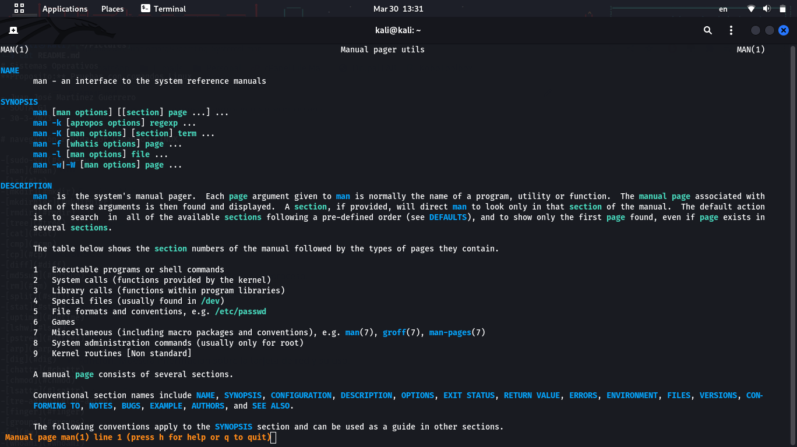

# Sistemas Operativos
**Proposito:** Pruebas con comandos Linux

- Juan José Martínez Guerrero
- SOUTA G1
- 30-3-2023

# navegación rápida por Comandos LINUX

--[sudo-su](#sudo-su)
--[man](#man)
--[ls](#ls)
--[mkdir](#mkdir)
--[mkdirhier](#mkdirhier)
--[rmdir](#rmdir)
--[tree](#tree)
--[cat](#cat)
--[cmp](#cmp)
--[cp](#cp)
--[diff](#diff)
--[md5sum](#md5Sum)
--[rm](#rm)
--[split](#split)
--[stat](#stat)
--[uptime](#uptime)
--[lshw](#lshw)
--[pstree](#pstree)
--[arp](#arp)
--[dig](#dig)
--[chattr](#chattr)
--[chmod](#chmod)
--[lsattr](#lsattr)
--[tre-agrep](#tre-agrep)
--[finger](#finger)
--[groups](#groups)
--[w](#w)
--[whoami](#whoami)
--[adduser](#adduser)
--[chsh](#chsh)
--[group add](#group-add)
--[gorup mod](#group-mod)
--[passwd](#passwd)
--[usermod](#usermod)
--[rtcwake](#rtcwake)
--[date](#date)
--[df](#df)
--[du](#du)
--[uname](#uname)
--[vmstat](#vmstat)
--[kill](#kill)
--[taskset](#taskset)
--[netstat](#netstat)

# Detalle de comandos

### sudo su 
- **Función:** Cambia a modo Superusuario
- **Uso:**  sudo su 
- **Imágen:** 
### man  
- **Función:**Abre el manual de uso de un programa o comando determinado.
man PROGRAMA/COMANDO  
 
### ls  
- **Función:** Lista información sobre el o los archivos del directorio actual. 
- **Uso:**  ls DIRECTORIO  
### mkdir  
- **Función:** Crea un directorio con el nombre dado en el directorio actual.
- **Uso:**  mkdir DIRECTORIO   
### mkdirhier  
- **Función:** Crea la jerarquía de directorios especificada.
- **Uso:**  mkdirhier DIRECTORIORAIZ/DIRECTORIOANIDADO   
### rmdir  
- **Función:** Elimina el directorio vacío
- **Uso:**  rmdir DIRECTORIO(vacio)   
### tree  
- **Función:** Muestra la jerarquía del directorio actual.
- **Uso:**  tree   
### cat  
- **Función:** Muestra en pantalla los contenidos linea a linea de un archivo.
- **Uso:**  cat ARCHIVO   
### cmp  
- **Función:** Compara byte a byte dos archivos.
- **Uso:**  cmp ARCHIVOA ARCHIVO B   
### cp  
- **Función:** Copia un archivo o un directorio de un punto A a un punto B.
- **Uso:**  cp ARCHIVO/DIRECTORIO DIRECTORIOALQUECOPIAR   
### diff  
- **Función:** Compara archivos línea a línea.
- **Uso:**  diff ARCHIVOA ARCHIVOB   
### md5sum  
- **Función:** Permite revisar checksums para prevenir alteraciones indeseadas a archivos.
- **Uso:**  md5sum ARCHIVO   
### rm  
- **Función:** Elimina el archivo o el directorio especificado.
- **Uso:**  rm ARCHIVO/DIRECTORIO   
### split  
- **Función:** Divide un archivo en segmentos más pequeños del tamaño determinado.
- **Uso:**  split ARCHIVO   
### stat  
- **Función:** Brinda estado de archivo o sistema.
- **Uso:**  stat ARCHIVO/NADA   
### uptime  
- **Función:** Muestra el tiempo activo del computador durante la sesión actual.
- **Uso:**  uptime   
### lshw  
- **Función:** Lista todo el hardware del dispositivo.
- **Uso:**  lshw   
### pstree  
- **Función:** Muestra procesos activos como árbol. 
- **Uso:**  pstree   
### arp  
- **Función:** Manipula el caché del protocolo IPv4.
- **Uso:**  arp NADA/IP   
### dig  
- **Función:** Permite pedir solucionar un DNS a un servidor de DNS.
- **Uso:**  dig IP   
### chattr  
- **Función:** Permite cambiar los atributos de un archivo.
- **Uso:**  chattr +ATRIBUTO -ATRIBUTO ARCHIVO   
### chmod  
- **Función:** Permite cambiar los permisos de acceson a un archivo.
- **Uso:**  chmod COMBINACIONDEUSUARIOS ARCHIVO   
### lsattr  
- **Función:** Lista los atributos de un archivo.
- **Uso:**  lsattr ARCHIVO   
### tre-agrep  
- **Función:** Permite buscar texto en un archivo.
- **Uso:**  tre-agrep -CANTIDADDEERRORESACEPTADOS ARCHIVO   
### finger  
- **Función:** Muestra la informacion del usuario actual y sus detalles.
- **Uso:**  finger   
### groups  
- **Función:** Muestra los grupos a los que pertenece un usuario. 
- **Uso:**  groups USUARIO   
### w  
- **Función:** Muestra los usuarios de la maquina y sus procesos.
- **Uso:**  w   
### whoami  
- **Función:** Muestra el nombre de usuario actual.
- **Uso:**  whoami   
### adduser  
- **Función:** Permite crear un usuario.
- **Uso:**  adduser --GRUPOS USUARIO   
### chsh  
- **Función:** Permite cambiar la terminal utilizada.
- **Uso:**  chsh TERMINAL   
### group add  
- **Función:** Permite gestionar los grupos en la maquina. 
- **Uso:**  group add GRUPO   
### group mod  
- **Función:** Permite cambiar los permisos de los grupos.
- **Uso:**  group mod PERMISOS   
### passwd  
- **Función:** Permite cambiar la contrasena de un usuario.
- **Uso:**  passwd USUARIO   
### usermod  
- **Función:** Permite modificar la configuracion de las cuentas.
- **Uso:**  usermod USUARIO   
### rtcwake  
- **Función:** Envia el dispositivo a hibernacion hasta que se llega a una hora establecida.
- **Uso:**  rtcwake FECHAHORA   
### date  
- **Función:** Muestra la fecha y hora actual del dispositivo.
- **Uso:**  date   
### df  
- **Función:** Retorna el usu de disco para los discos.
- **Uso:**  df DISCO   
### du  
- **Función:** Retorna el uso de disco de los archivos en el directorio actual.
- **Uso:**  du DIRECTORIO   
### uname  
- **Función:** Muestra informacion del sistema.
- **Uso:**  uname   
### vmstat  
- **Función:** Muestra informacion sobre la memoria virtual.
- **Uso:**  vmstat   
### kill  
- **Función:** Mata un proceso.
- **Uso:**  kill PROCESO   
### taskset  
- **Función:** Establece nucleos especificos a un proceso.
- **Uso:**  taskset CODIGOHEXADELOSNUCLEOS  
### netstat  
- **Función:** Muestra informacion sobre la tarjeta de red y su uso.
- **Uso:**  netstat  
