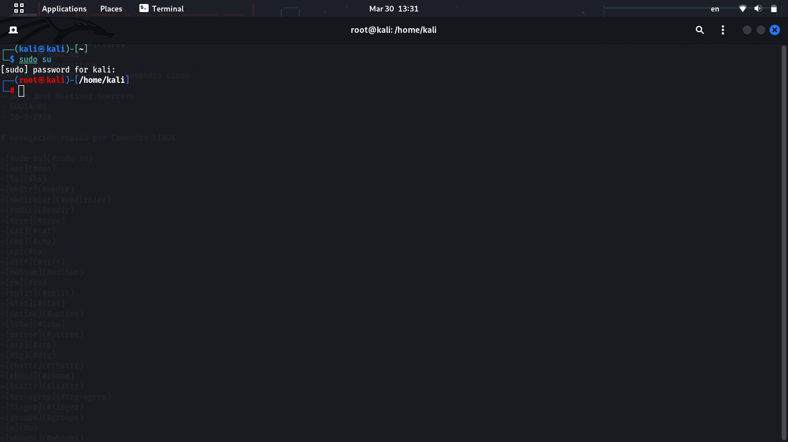

# Sistemas Operativos
- Juan José Martínez Guerrero
- SOUTA G1
- 30-3-2023

# Comandos LINUX

| Comando | Función  | Uso  | Imágen |
| ------- | --- | --- | --- |
| sudo su | Cambia a modo Superusuario | usage |  |
| man | Cambia a modo Superusuario | usage |  |
| ls | Cambia a modo Superusuario | usage |  |
| mkdir | Cambia a modo Superusuario | usage |  |
| mkdirhier | Cambia a modo Superusuario | usage |  |
| rmdir | Cambia a modo Superusuario | usage |  |
| tree | Cambia a modo Superusuario | usage |  |
| cat | Cambia a modo Superusuario | usage |  |
| cmp | Cambia a modo Superusuario | usage |  |
| cp | Cambia a modo Superusuario | usage |  |
| diff | Cambia a modo Superusuario | usage |  |
| md5sum | Cambia a modo Superusuario | usage |  |
| rm | Cambia a modo Superusuario | usage |  |
| split | Cambia a modo Superusuario | usage |  |
| stat | Cambia a modo Superusuario | usage |  |
| uptime | Cambia a modo Superusuario | usage |  |
| is | Cambia a modo Superusuario | usage |  |
| pstree | Cambia a modo Superusuario | usage |  |
| arp | Cambia a modo Superusuario | usage |  |
| dig | Cambia a modo Superusuario | usage |  |
