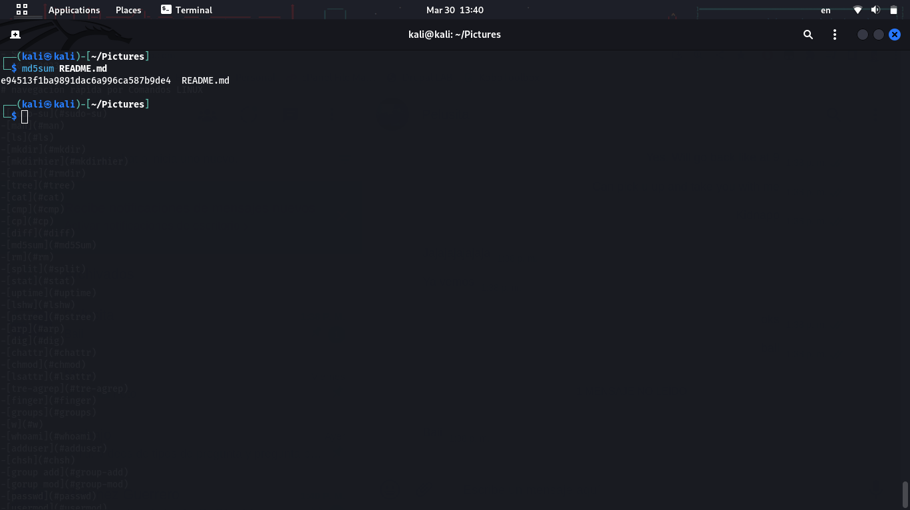

# Sistemas Operativos
**Proposito:** Pruebas con comandos Linux

- Juan José Martínez Guerrero
- SOUTA G1
- 30-3-2023

# navegación rápida por Comandos LINUX

-[sudo-su](#sudo-su)
-[man](#man)
-[ls](#ls)
-[mkdir](#mkdir)
-[mkdirhier](#mkdirhier)
-[rmdir](#rmdir)
-[tree](#tree)
-[cat](#cat)
-[cmp](#cmp)
-[cp](#cp)
-[diff](#diff)
-[md5sum](#md5Sum)
-[rm](#rm)
-[split](#split)
-[stat](#stat)
-[uptime](#uptime)
-[lshw](#lshw)
-[pstree](#pstree)
-[arp](#arp)
-[dig](#dig)
-[chattr](#chattr)
-[chmod](#chmod)
-[lsattr](#lsattr)
-[tre-agrep](#tre-agrep)
-[finger](#finger)
-[groups](#groups)
-[w](#w)
-[whoami](#whoami)
-[adduser](#adduser)
-[chsh](#chsh)
-[groupadd](#groupadd)
-[groupmod](#groupmod)
-[passwd](#passwd)
-[usermod](#usermod)
-[rtcwake](#rtcwake)
-[date](#date)
-[df](#df)
-[du](#du)
-[uname](#uname)
-[vmstat](#vmstat)
-[kill](#kill)
-[taskset](#taskset)
-[netstat](#netstat)

# Detalle de comandos

### sudo su 
- **Función:** Cambia a modo Superusuario
- **Uso:** sudo su 
- **Imágen:** 
### man 
- **Función:** Abre el manual de uso de un programa o comando determinado.
- **Uso:** man PROGRAMA/COMANDO
- **Imágen:**  
### ls 
- **Función:** Lista información sobre el o los archivos del directorio actual. 
- **Uso:** ls DIRECTORIO 
- **Imágen:** 
### mkdir 
- **Función:** Crea un directorio con el nombre dado en el directorio actual.
- **Uso:** mkdir DIRECTORIO 
- **Imágen:**  
### mkdirhier 
- **Función:** Crea la jerarquía de directorios especificada.
- **Uso:** mkdirhier DIRECTORIORAIZ/DIRECTORIOANIDADO 
- **Imágen:**  
### rmdir 
- **Función:** Elimina el directorio vacío
- **Uso:** rmdir DIRECTORIO(vacio)
- **Imágen:**  
### tree 
- **Función:** Muestra la jerarquía del directorio actual.
- **Uso:** tree
- **Imágen:**  
### cat 
- **Función:** Muestra en pantalla los contenidos linea a linea de un archivo.
- **Uso:** cat ARCHIVO
- **Imágen:**  
### cmp 
- **Función:** Compara byte a byte dos archivos.
- **Uso:** cmp ARCHIVOA ARCHIVO B 
- **Imágen:**  
### cp 
- **Función:** Copia un archivo o un directorio de un punto A a un punto B.
- **Uso:** cp ARCHIVO/DIRECTORIO DIRECTORIOALQUECOPIAR 
- **Imágen:**  
### diff 
- **Función:** Compara archivos línea a línea.
- **Uso:** diff ARCHIVOA ARCHIVOB 
- **Imágen:**  
### md5sum 
- **Función:** Permite revisar checksums para prevenir alteraciones indeseadas a archivos.
- **Uso:** md5sum ARCHIVO 
- **Imágen:**  
### rm 
- **Función:** Elimina el archivo o el directorio especificado.
- **Uso:** rm ARCHIVO/DIRECTORIO 
- **Imágen:**  
### split 
- **Función:** Divide un archivo en segmentos más pequeños del tamaño determinado.
- **Uso:** split ARCHIVO 
- **Imágen:**  
### stat 
- **Función:** Brinda estado de archivo o sistema.
- **Uso:** stat ARCHIVO/NADA 
- **Imágen:**  
### uptime 
- **Función:** Muestra el tiempo activo del computador durante la sesión actual.
- **Uso:** uptime 
- **Imágen:**  
### lshw 
- **Función:** Lista todo el hardware del dispositivo.
- **Uso:** lshw 
- **Imágen:**  
### pstree 
- **Función:** Muestra procesos activos como árbol. 
- **Uso:** pstree 
- **Imágen:**  
### arp 
- **Función:** Manipula el caché del protocolo IPv4.
- **Uso:** arp NADA/IP 
- **Imágen:**  
### dig 
- **Función:** Permite pedir solucionar un DNS a un servidor de DNS.
- **Uso:** dig IP 
- **Imágen:**  
### chattr 
- **Función:** Permite cambiar los atributos de un archivo.
- **Uso:** chattr +ATRIBUTO -ATRIBUTO ARCHIVO 
- **Imágen:**  
### chmod 
- **Función:** Permite cambiar los permisos de acceson a un archivo.
- **Uso:** chmod COMBINACIONDEUSUARIOS ARCHIVO 
- **Imágen:**  
### lsattr 
- **Función:** Lista los atributos de un archivo.
- **Uso:** lsattr ARCHIVO 
- **Imágen:**  
### tre-agrep 
- **Función:** Permite buscar texto en un archivo.
- **Uso:** tre-agrep -CANTIDADDEERRORESACEPTADOS ARCHIVO 
- **Imágen:**  
### finger 
- **Función:** Muestra la informacion del usuario actual y sus detalles.
- **Uso:** finger 
- **Imágen:**  
### groups 
- **Función:** Muestra los grupos a los que pertenece un usuario. 
- **Uso:** groups USUARIO 
- **Imágen:**  
### w 
- **Función:** Muestra los usuarios de la maquina y sus procesos.
- **Uso:** w 
- **Imágen:**  
### whoami 
- **Función:** Muestra el nombre de usuario actual.
- **Uso:** whoami 
- **Imágen:**  
### adduser 
- **Función:** Permite crear un usuario.
- **Uso:** adduser --GRUPOS USUARIO 
- **Imágen:**  
### chsh 
- **Función:** Permite cambiar la terminal utilizada.
- **Uso:** chsh TERMINAL 
- **Imágen:**  
### groupadd 
- **Función:** Permite gestionar los grupos en la maquina. 
- **Uso:** group add GRUPO 
- **Imágen:**  
### group mod 
- **Función:** Permite cambiar los permisos de los grupos.
- **Uso:** group mod PERMISOS
- **Imágen:**  
### passwd 
- **Función:** Permite cambiar la contrasena de un usuario.
- **Uso:** passwd USUARIO
- **Imágen:**  
### usermod 
- **Función:** Permite modificar la configuracion de las cuentas.
- **Uso:** usermod USUARIO
- **Imágen:**  
### rtcwake 
- **Función:** Envia el dispositivo a hibernacion hasta que se llega a una hora establecida.
- **Uso:** rtcwake FECHAHORA
- **Imágen:**  
### date 
- **Función:** Muestra la fecha y hora actual del dispositivo.
- **Uso:** date
- **Imágen:**  
### df 
- **Función:** Retorna el usu de disco para los discos.
- **Uso:** df DISCO
- **Imágen:**  
### du 
- **Función:** Retorna el uso de disco de los archivos en el directorio actual.
- **Uso:** du DIRECTORIO 
- **Imágen:**  
### uname 
- **Función:** Muestra informacion del sistema.
- **Uso:** uname
- **Imágen:**  
### vmstat 
- **Función:** Muestra informacion sobre la memoria virtual.
- **Uso:** vmstat
- **Imágen:**  
### kill 
- **Función:** Mata un proceso.
- **Uso:** kill PROCESO
- **Imágen:**  
### taskset 
- **Función:** Establece nucleos especificos a un proceso.
- **Uso:** taskset CODIGOHEXADELOSNUCLEOS
- **Imágen:**  
### netstat 
- **Función:** Muestra informacion sobre la tarjeta de red y su uso.
- **Uso:** netstat
- **Imágen:**  
